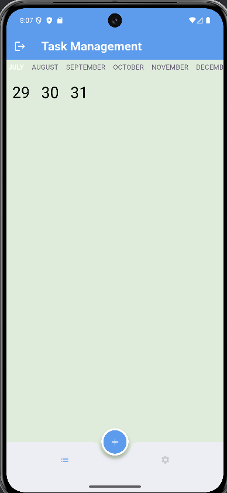
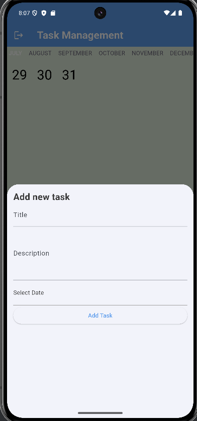
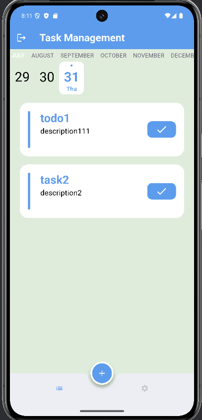
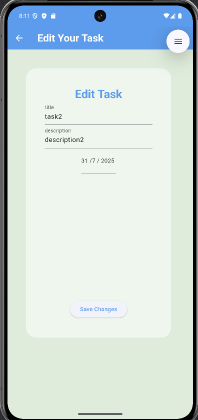

# to_do

A Flutter project designed to help users organize and track their daily activities. this application allows users to create, update, and delete tasks in an intuitive, user-friendly interface. It incorporates backend storage for task persistence, making it easy to retain task data across sessions.

## Main packages used

- [Provider](https://pub.dev/packages/provider) as state management.
- [firebase authentication](https://firebase.google.com/docs/auth/flutter/start) to store user sessions and handles login/logout automatically.
- [cloud firestore](https://pub.dev/packages/cloud_firestore) to store structured data and keep it in sync across devices in real time.
- [shared_preferences](https://pub.dev/packages/shared_preferences) to handle caching data

## App ScreenShots

Here are some screenshots for the application:

### 📽️ Demo Video

[▶️ Watch the video](https://drive.google.com/file/d/12AlZwLngTAVxEHLXkzdpwz8JJ0SqAAV3/view?usp=sharing)
